# Latihan Praktikum 10
## 8.2.3 Pertanyaan
1. Karena, jika atribut front dan rear diinisialisasi dengan 0 maka, atribut tersebut sudah merujuk kepada datanya. Jadi, perlu diasumsikan bahwa atribut front dan rear belum merujuk ke data manapun sehingga diinisialisasi dengan nilai -1.
2. Jika enqueue ada pada kondisi ketiga, maka ketika dimasukkan data baru, maka data tersebut akan menempati
posisi indeks ke-0, artinya posisi rear = 0.
3. 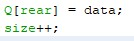
4. 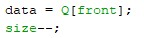
5. Karena posisi front bisa berubah kapan saja ketika terjadi pergantian antrian, sehingga lebih baik menggunakan i = front.
7. Maksud dari potongan kode tersebut adalah untuk mencetak data sesuai dengan indeksnya secara berurutan sampai batas maksimalnya.

## 8.3.3 Pertanyaan
1. Untuk menginstansiasi dan menginialisasi object Penumpang pada class Queue.
2. Akan terjadi error, karena pada class Penumpang menggunakan parameter konstruktor sehingga perlu dilakukan inisialisasi.
3. 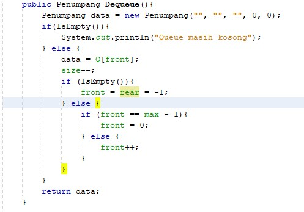
4. 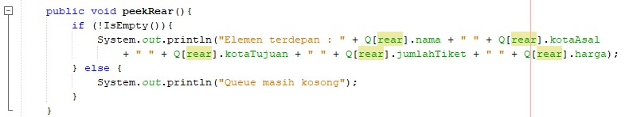 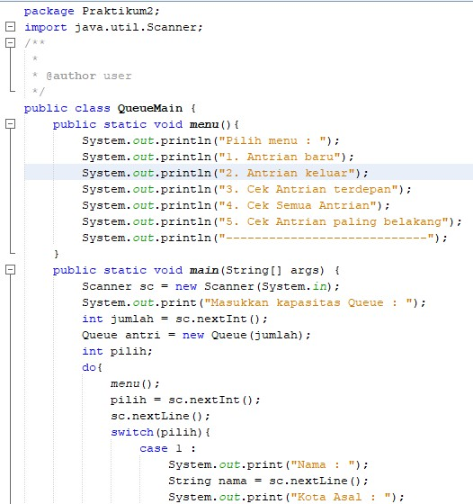 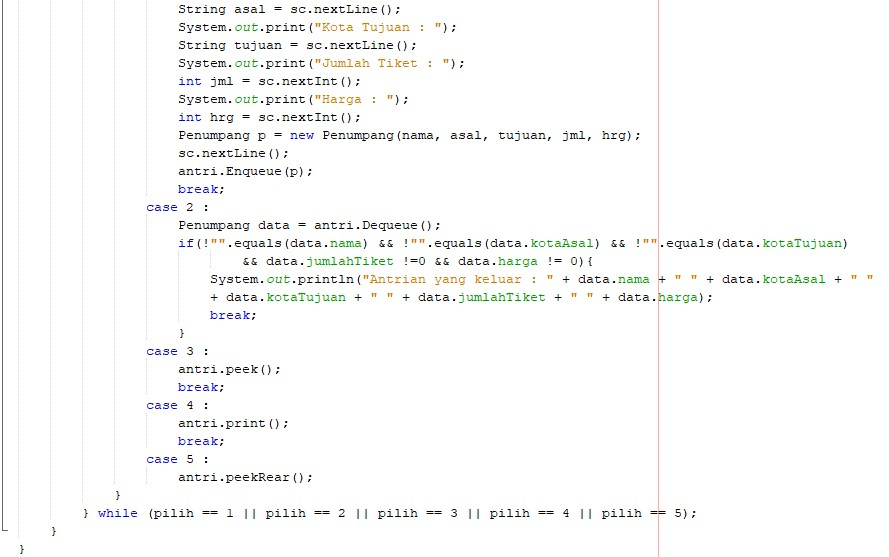

# Source Code & Hasil Output Program

## 8.2.1 Percobaan
1. Source Code

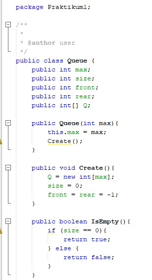 

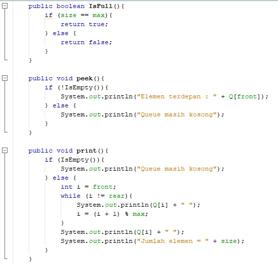

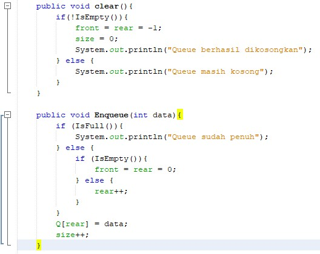

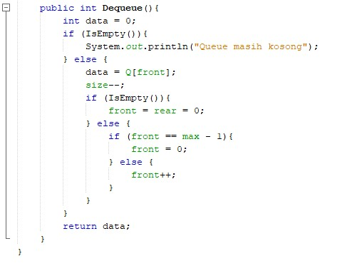

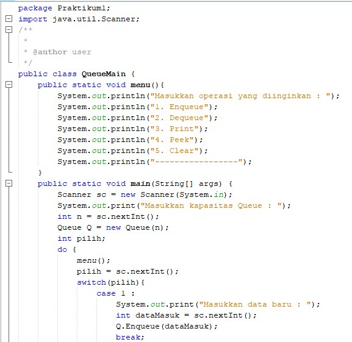

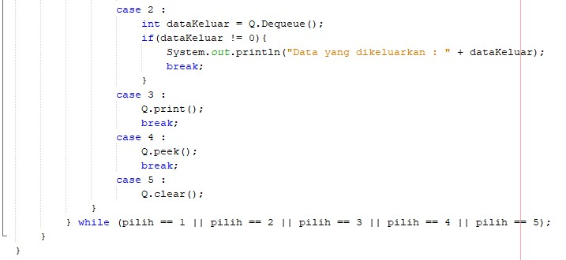

2. Hasil Output

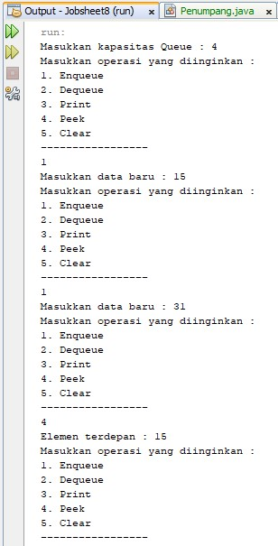

## 8.3.1 Percobaan
1. Source Code

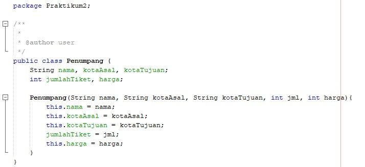

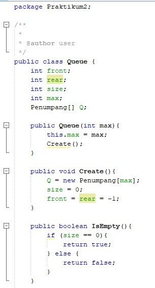

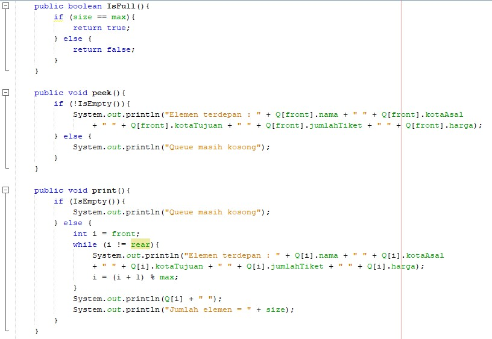

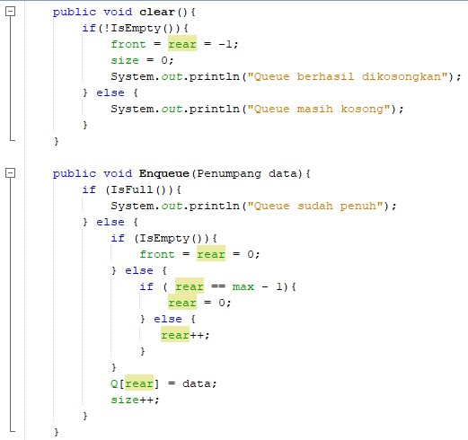

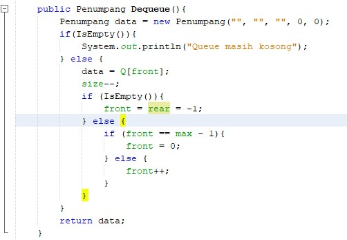

2. Hasil Output

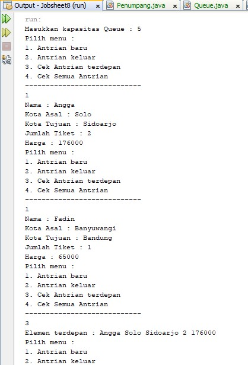