# Latihan Praktikum 11

## 9.2.3 Pertanyaan
1. Karena pada saat class SLLMain dijalankan, perintah pertama yang dilakukan adalah s.print() dan kondisi pada saat itu, linked list belum memiliki isi atau value. Sehingga yang ditampilkan adalah "Linked List Kosong'.
2. Digunakan untuk memasukkan node yang memiliki data input setelah node yang memiliki data key.
3. Digunakan untuk menggeser tempat indeks yang ada sebelumnya ke tempat yang akan ditempati oleh indeks baru yang diinputkan.

## 9.3.3
1. Supaya, ketika terjadi penghapusan atau pada saat meremove data, data yang lainnya tidak ikut terhapus.
2. Digunakan untuk melakukan penghapusan sesuai dengan key jika memenuhi kondisi temp.next.data == key.
3. Nilai yang dikembalikan pada method indexOf yang pertama adalah nilai -1 apabila memnuhi kondisi tmp == null. Jika, tidak maka nilai yang dikembalikan adalah nilai dari index yang dicari.

# Source Code & Hasil Output

## 9.2.1 Percobaan
1. Source Code

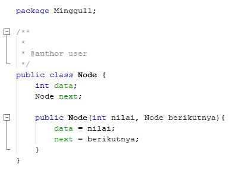

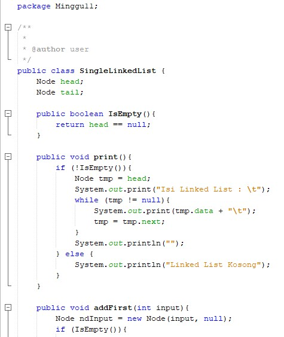

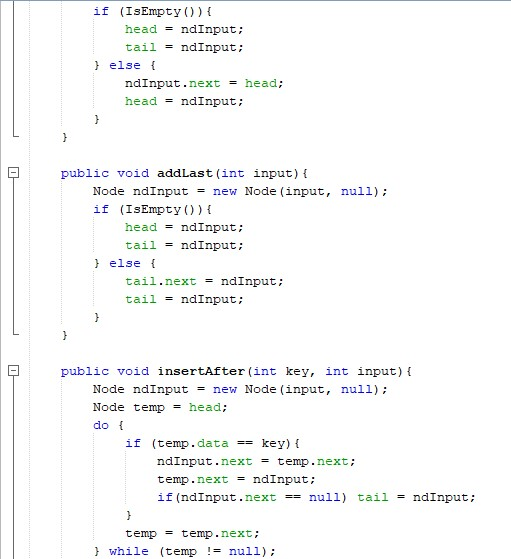

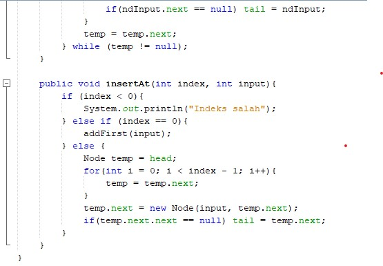

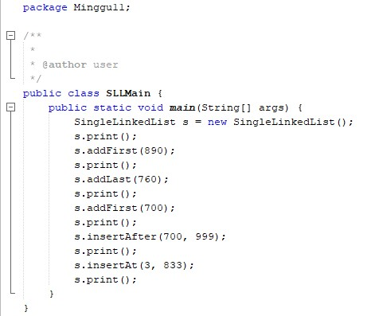

2. Hasil Output

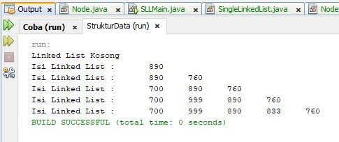

## 9.3.1 Percobaan
1. Source Code

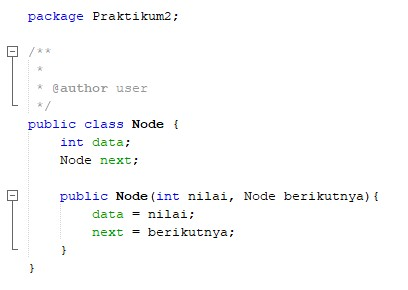

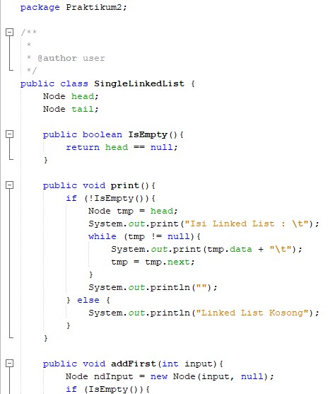

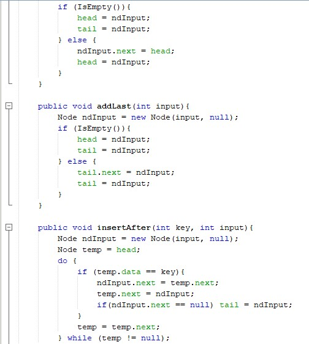

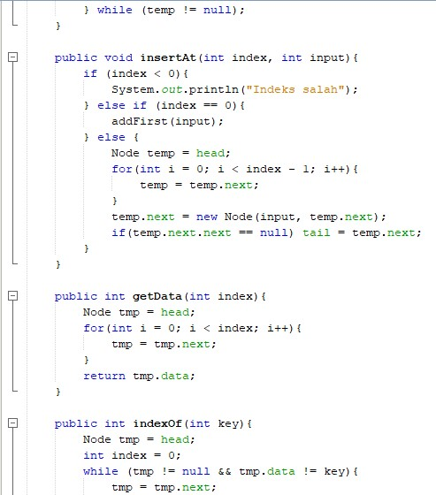

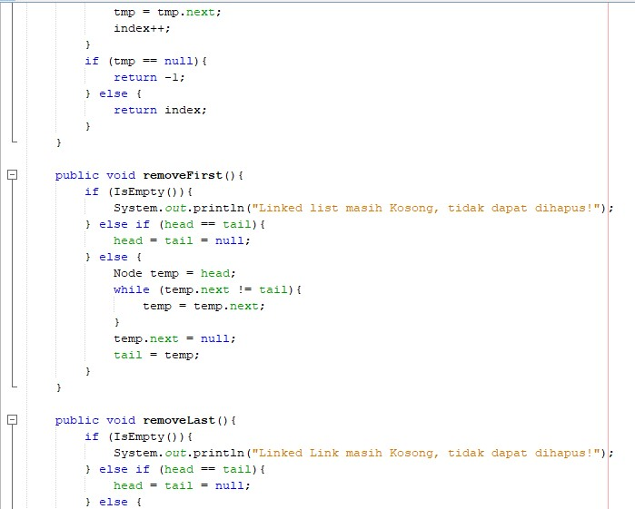

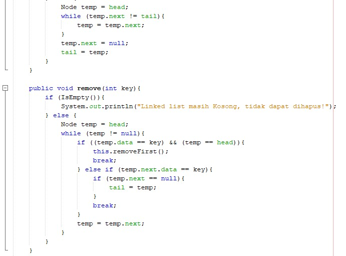

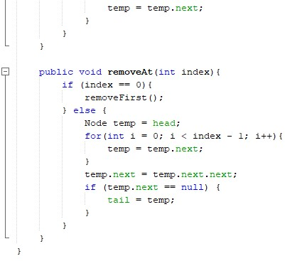

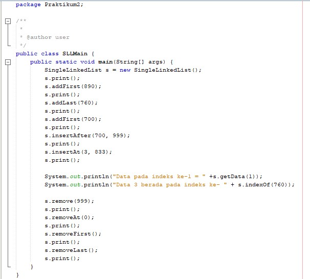

2. Hasil Output

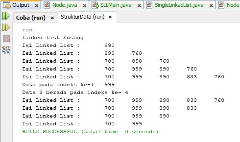