# Latihan Praktikum 12

## 12.2.3 Pertanyaan Percobaan
1. Singly Linked List merupakan suatu linked list yang hanya memiliki satu variabel pointer saja. Dimana pointer tersebut menunjuk ke node selanjutnya, biasanya field pada tail menunjuk ke NULL. Sedangkan, Double Linked List merupakan suatu linked list yang memiliki dua variabel pointer yaitu pointer yang menunjuk ke node selanjutnya dan pointer yang menunjuk ke node sebelumnya. Setiap head dan tailnya juga menunjuk ke NULL.
2. Atribut next digunakan untuk merujuk kepada node selanjutnya, sedangkan atribut prev digunakan untuk merujuk kepada node sebelumnya.
3. Inisialisasi head = 0 digunakan untuk menunjukkan bahwa isi dari data pada class Node masih kosong, sedangkan size = 0 digunakan untuk menunjukkan bahwa ukurannya data juga masih kosong.
4. Karena, jika misalkan data tersebut sudah memiliki head sebelumnya, maka Maka bagian header harus dipindahkan dulu ke dalam previous,
kemudian Node next berisi bagian di sebelah kanan next.
5. Data yang baru dimasukkan akan menjadi head pada newNode.
6. Digunakan untuk Menambahkan data pada bagian akhir linked lists diawali dengan
penentuan Node akhir sebagai lokasi yang akan ditambah,
kemudian Node baru akan ditambahkan pada posisi lokasi next. Setelah itu Node Baru memiliki next yang berisi null.

## 12.3.3 Pertanyaan Percobaan

1. Head sebelumnya yang telah diremove akan digantikan dengan head baru setelah head yang diremove sebelumnya.
2. Dengan cara memastikan apakah setelah node terakhir sama dengan null, jika iya maka akan dilakukan penghapusan.
3. Karena potongan kode tersebut hanya akan menghapus data yang berada pada head saja dan tidak bisa merujuk kepada data yang ingin dihapus pada indeks manapun.
4. current.prev.next = current.next; digunakan untuk menghapus node sebelumnya dan node selanjutnya akan mengisi node sebelumnya yang telah dihapus, sedangkan current.next.prev = current.prev; digunakan untuk menghapus node selanjutnya dan mengisi node sebelumnya akan mengisi node selanjutnya yang telah dihapus.

## 12.4.3 Pertanyaan Percobaan
1. Method size digunakan untuk menghitung jumlah node yang telah diisikan.
2. Dengan cara menambahkan +1 pada index supaya index dapat dimulai dari angka 1.
3. Fungsi Method Add pada Double Linked List, menggunakan dua node yang digunakan sebagai logika untuk menambahkan node pada indeks tertentu, yaitu node prev dan next. Sedangkan, fungsi method Add pada Single Linked List hanya menggunakan satu node untuk menambahkan node pada indeks tertentu, yaitu node next.
4. Pada method isEmpty logika a, menggunakan size sebagai logikanya. Jika size == 0, maka nilai yang dikembalikan adalah true, jika tidak maka nilai yang dikembalikan adalah false. Sedangkan, pada method isEmpty logika b, menggunakan nilai kembalian head == null, jika head masih kosong maka, node tersebut masih kosong.

# Source Code & Hasil Output

## 12.2.1 Percobaan
1. Source Code

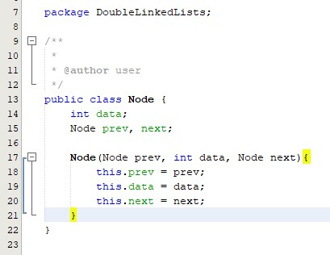

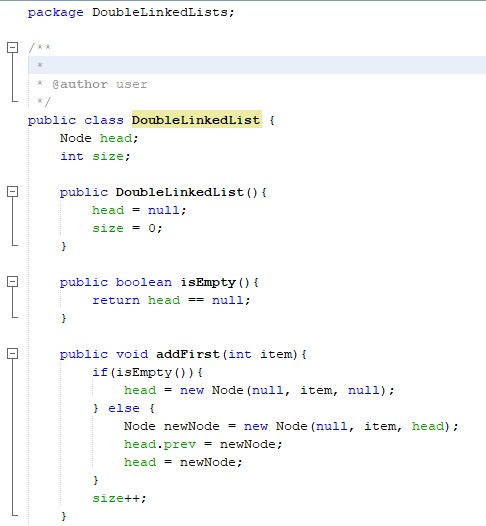

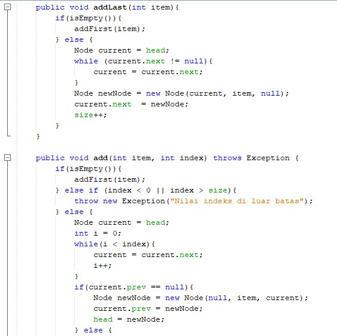

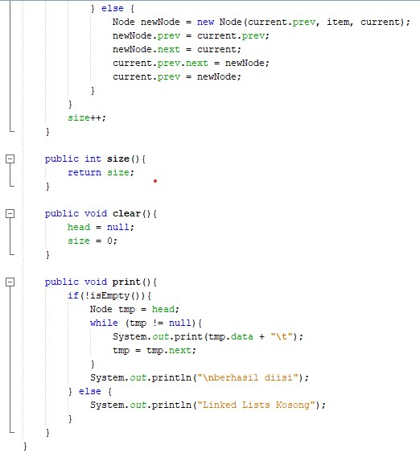

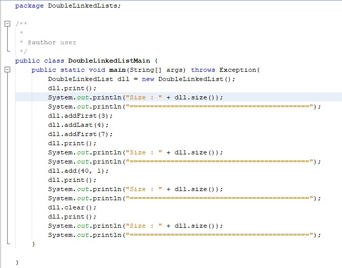

2. Hasil Output 

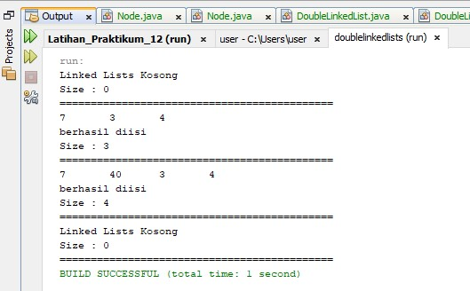

## 12.3.1 Percobaan
1. Source Code

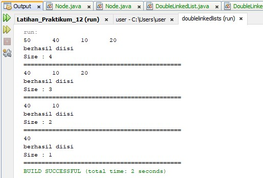

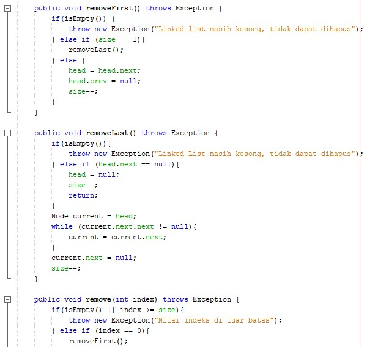

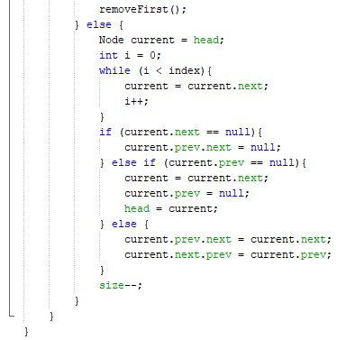

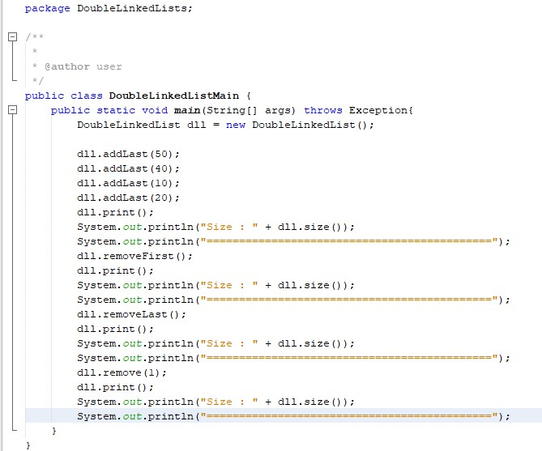

2. Hasil Output

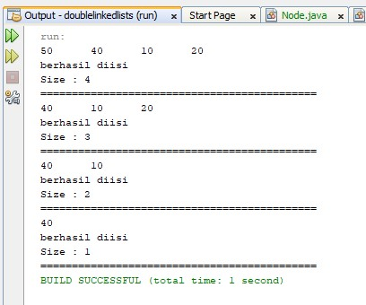

## 12.4.1 Percobaan
1. Source Code

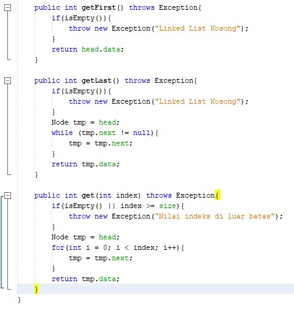

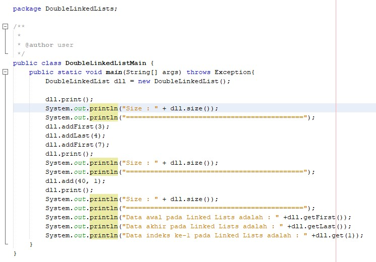

2. Hasil Output

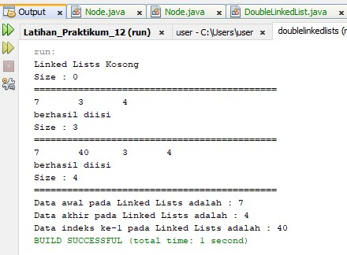
