# Latihan Praktikum 14

## 13.2.2 Pertanyaan Percobaan
1. Karena, pada binary search tree menggunakan method find yang digunakan untuk mencari letak data tertentu.
2. Pada class Node digunakan untuk menampung sebuah elemen dalam tree yang berisi sebuah informasi. Kegunaan atribut left dan right pada class Node digunakan untuk merepresentasikan dari child yang ada pada tree. Pada, binary tree untuk setiap node hanya memiliki maksimal 2 child, yaitu kiri(left-child) dan kana (right-child).
3.  a. Atribut root digunakan untuk menentukan node paling puncak(head) pada sebuah tree.
3. b. Iya
4. Node baru yang ditambahkan pada tree yang masih kosong tersebut akan menjadi root.
5. Digunakan untuk meletakkan data baru pada sebelah kiri dari binary tree.

## 13.3.2 Pertanyaan Percobaan
1. Digunakan sebagai index terakhir pada sebuah tree.
2. Digunakan untuk menambahkan atau memasukkan data yang telah dibuat pada array dan menentukan indeks terakhirnya.
3. Digunakan untuk mengunjungi left child, kemudian mencetak isi node yang dikunjungi, kemudian selanjutnya mengunjungi right child.
4. 3 & 4
5. Digunakan untuk membatasi tree hanya sampai pada indeks ke 6.

# Source Code & Hasil Output

## 13.2.1 Prosedur Percobaan
1. Source Code

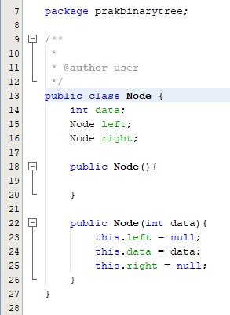

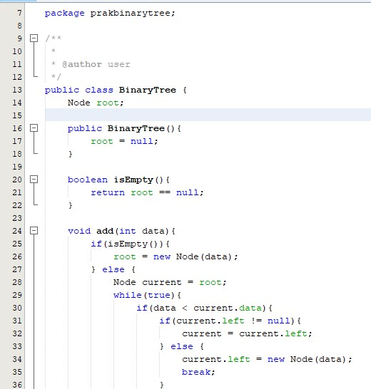

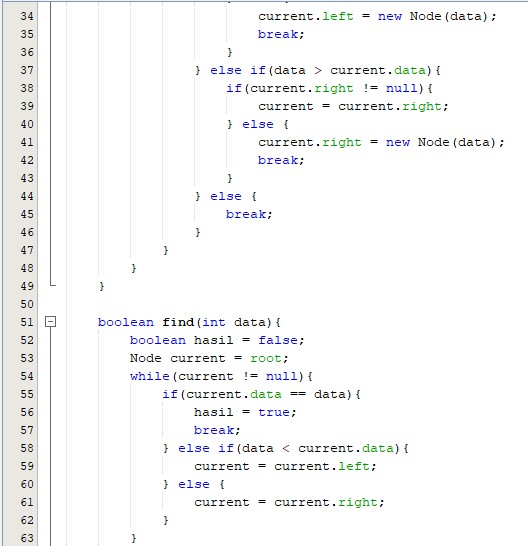

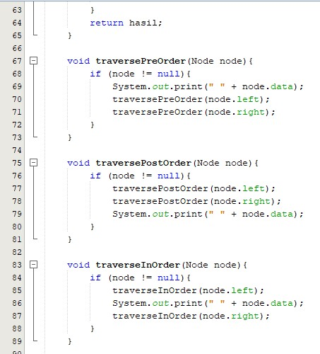

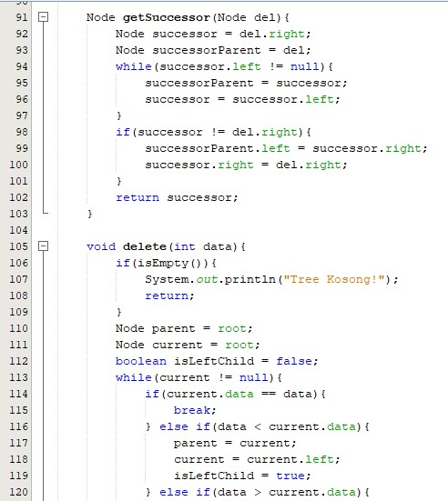

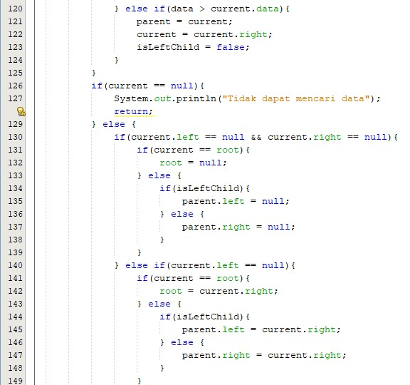

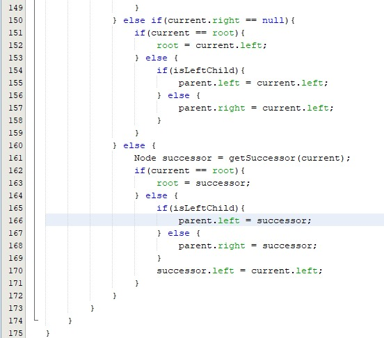

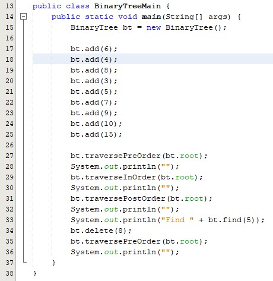

2. Hasil Output

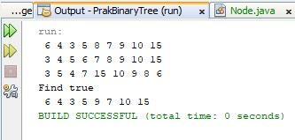

## 13.3.1 Prosedur Percobaan
1. Source Code

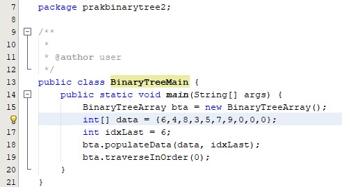

2. Hasil Output

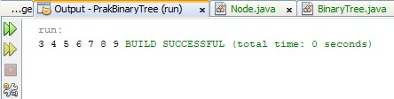