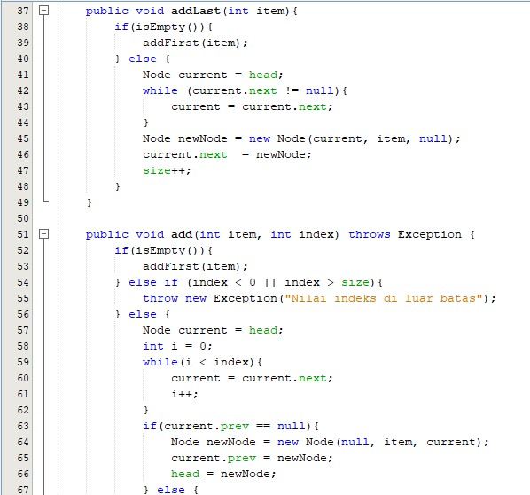
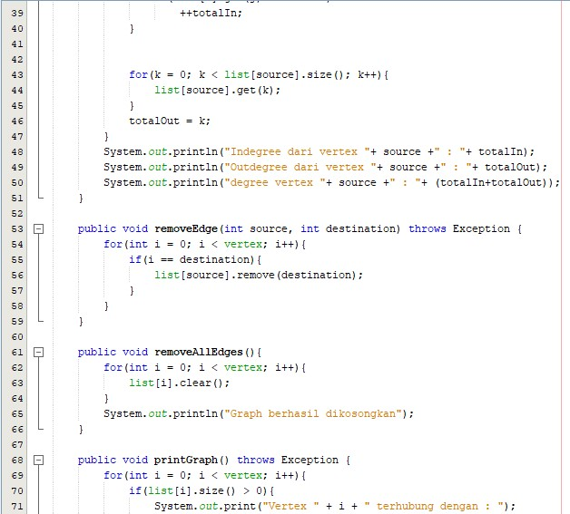

# Latihan Praktikum 14

## 12.2.3 Pertanyaan Percobaan 
1. BFS : Digunakan sebagai algoritma pencarian. DFS : Digunakan sebagai algoritma pencarian. Algoritma Bellman-Ford = Untuk menemukan lintasan terpendek. Algoritma Boruvska= Untuk menentukan pohon penjangkau minimum.
2. Untuk memanggil fungsi linked list dan mengisi list yang berupa vertex pada
linked list tersebut.
3. Untuk mengenalkan pertama kali vertex tersebut dan juga koneksinya.
4. Dengan cara melakukan looping vertex. Jadi, jika vertex lebih besar dari (i)
dan destination sama dengan (i) maka edge akan otomatis dihapus.
5. Dengan cara melakukan looping vertex. Jadi, jika vertex lebih besar dari (i)
dan destination sama dengan (i) maka edge akan otomatis dihapus.

## 12.3.3 Pertanyaan Percobaan
1. Pada directed graph degree mempengaruhi bobot pada edge antar vertex (bobotnya tidak sama antara A ke B dan B ke A). Sedangkan undirected graph degree tidak mempengaruhi bobot (bobot antara A ke B dan B ke A nilai bobotnya sama). Jika pada directed graph degree nya bisa berbeda untuk derajat in dan out nya ,pada undirected maka degree nya sama.
2. Karena vertex dimasukkan ke dalam matriks sedangkan pada matriks indeks
pertama dimulai dari 0. Maka, agar vertex dalam matrix sama dengan vertex yang
aslinya harus di +1.
3. Kegunaan method getEdge() adalah untuk menampilkan apakah vertex
tersedia atau tidak di dalam graph.
4. Jenis graph tersebut termasuk ke dalam adjacency matrix yaitu directed
graph.
5. Karena untuk menangani proses penanganan error agar program tetap
berjalan meskipun ada error serta agar tidak terjadi hang.

# Source Code & Hasil Output
## 12.2.1 Percobaan
1. Source Code

2. Hasil Output

## 12.3.1 Percobaan
1. Source Code

2. Hasil Output 

