# Latihan Praktikum 15

## 16.2.3 Pertanyaan Percobaan
1. Karena didalam tipe data tersebut tidak ada kurung siku yg menyatakan tipe
data apa yang bisa disimpan, sehingga bisa menyimpan atau menampung semua jenis
data.

2. Hasil Modifikasi :
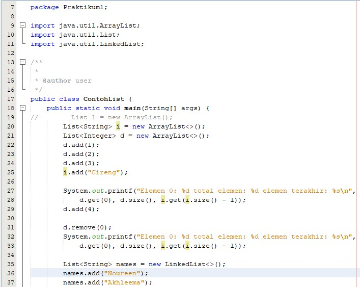

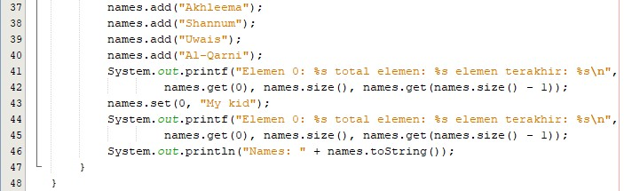

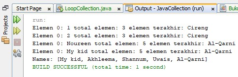

3. 

4. 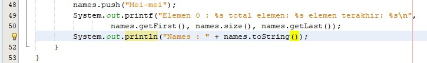

5. Dengan mengubah kode LinkedList maka kita dapat menggunakan perintah push untuk penambahan objek “Mei-mei”. Jika menggunakan List saja tidak bisa menggunakan method push, hanya bisa menggunakan method add saja. Dan untuk pemanggilan objek terakhir pada LinkedList digunakan method getLast sedangkan pada List menggunakan methodnames.get(names size()-1));
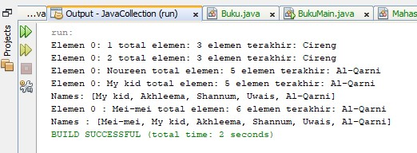

## 16.3.3 Pertanyaan Percobaan
1. Untuk fungsinya sama,yaitu sama-sama menambahkan objek, push dimiliki class stack sedangkan add ada pada interface atau ada pada listnya.

2. Yang terjadi adalah data melon dan durian tidak muncul di output dikarenakan kedua data tersebut tidak dimasukkan atau tidak berada di dalam stack.
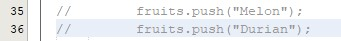

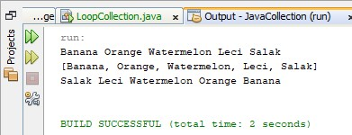

3. Fungsi dari baris tersebut adalah untuk mengakses dan menampilkan nilai, dari seluruh element yang ada pada Stack. Menggunkan method hasNext() untuk mengecek kondisi, apakah objek iterator, masih mempunyai nilai pada selanjutnya atau tidak. Sedangkan kita menggunakan method .next() untuk menampilkan nilai selanjutnya pada elemen.

4. Yang terjadi adalah kode program tersebut mengalami error. Karena, pada class tersebut menggunakan method yang ada di dalam collection stack bukan collection list.
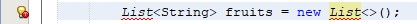

5. 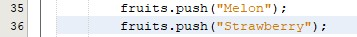

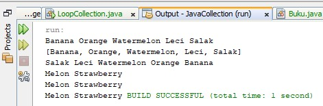

6. 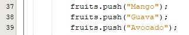

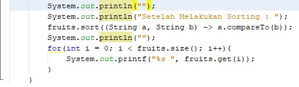

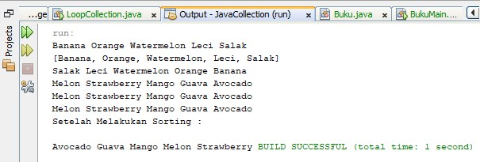

## 16.4.3 Pertanyaan Percobaan
1.  Kelebihannya yaitu dapat mengambil argument tanpa batas tertentu dan memiliki parameter lebih dari satu.

2. 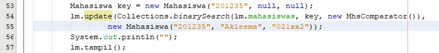

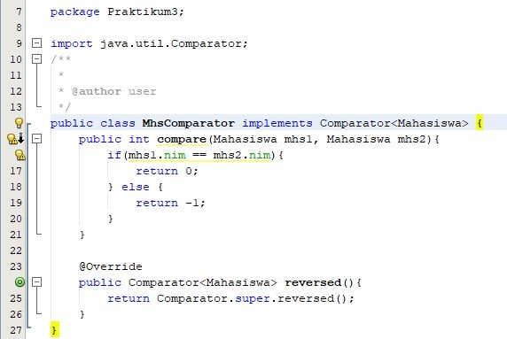

3. 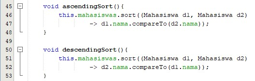

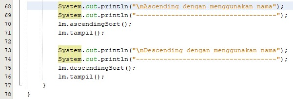

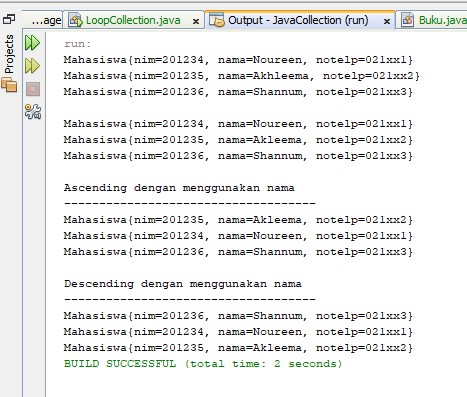

# Source Code & Hasil Output
## 16.2.1 Percobaan
1. Source Code

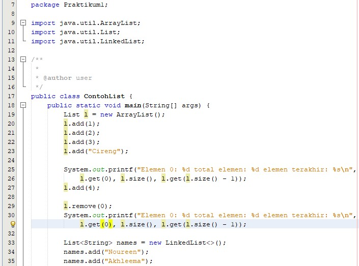

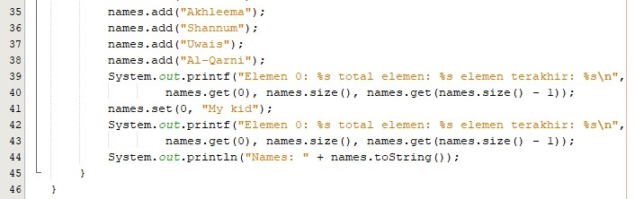

2. Hasil Output

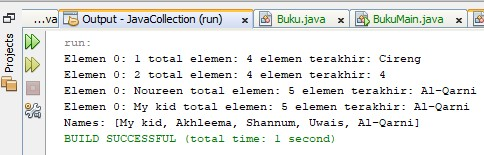

## 16.3.1 Percobaan 2
1. Source Code
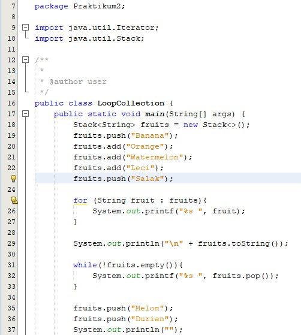

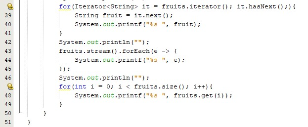

2. Hasil Output

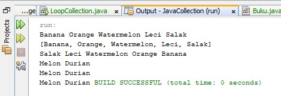

## 16.4.1 Percobaan 3
1. Source Code
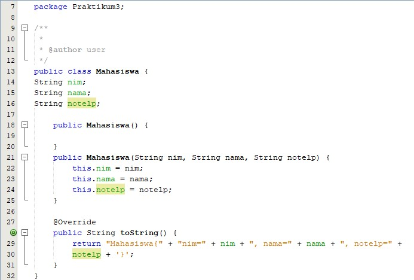

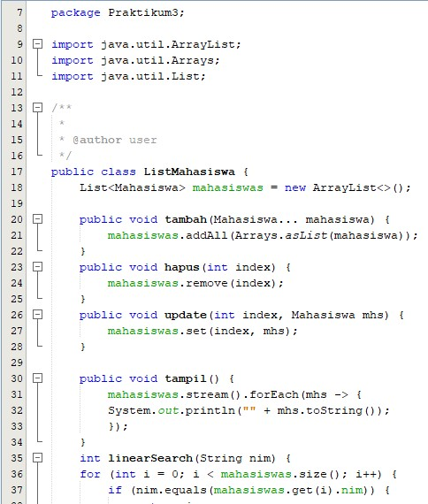

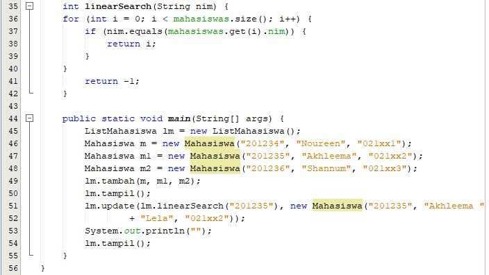

2. Hasil Output

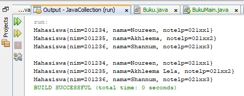

