# Latihan Soal Praktikum 3
## Pertanyaan 3.2.3
1. Iya, jika array of object tidak memiliki atribut dan method, maka hal itu tidak bisa disebut dengan array of object, melainkan hanya sebuah array saja.
2. Tidak, hal tersebut dilakukan untuk instansiasi dan deklarasi nilai pada array elemen ke 1 dan seterusnya.
3. Kode tersebut merupakan panjang elemen atau jumlah elemen array of object yang akan dibuat dan merupakan bagian dari deklarasi serta instansiasi dari array of object.
4. Kode tersebut merupakan instansiasi yang digunakan untuk memberikan nilai pada elemen array of object ke 1.
5. Supaya konsep array of object lebih mudah dipahami lagi.
## Pertanyaan 3.3.3
1. Dapat
2. Contohnya, program untuk Pelaporan Data Gudang. Setiap gudang yang terdaftar pada satu perusahaan akan melaporkan data tersebut kepada perusahaan yang menaunginya.
3.  Karena pada setiap elemen array tidak dilakukan instansiasi dan deklarasi terlebih dahulu.
4. 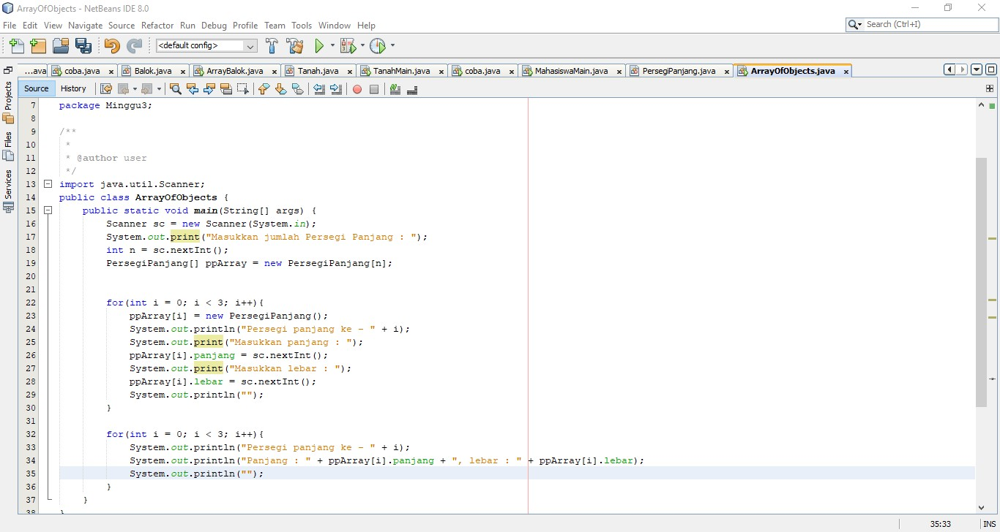
5. Boleh, namun Program akan hanya mencetak elemen array yang telah dilakukan instansiasi pada ppArray[i] saja.
## Pertanyaan 3.4.3
1. Tidak dapat, karena satu konstruktor hanya untuk satu kelas dan jika ada dua konstruktor dalam satu kelas akan mengalami error. Contohnya :
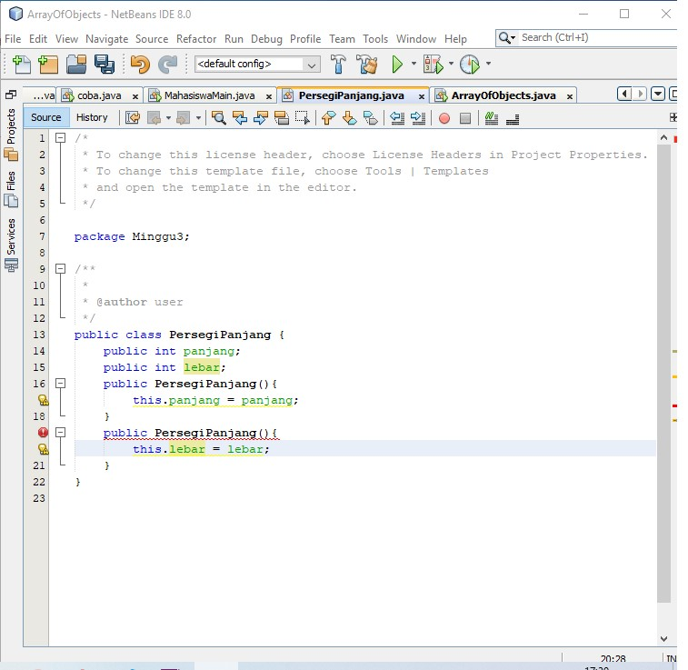 
2. 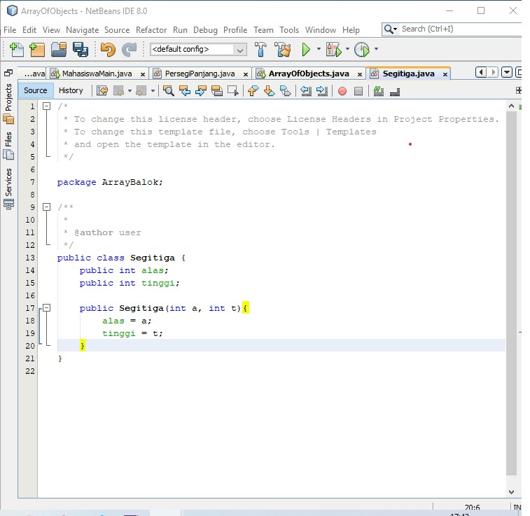
3. 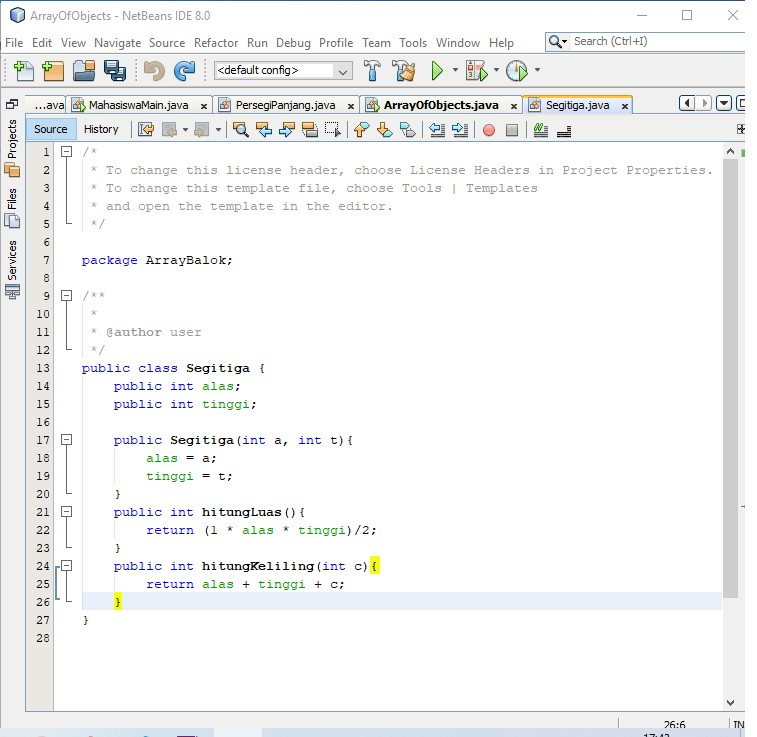
4. 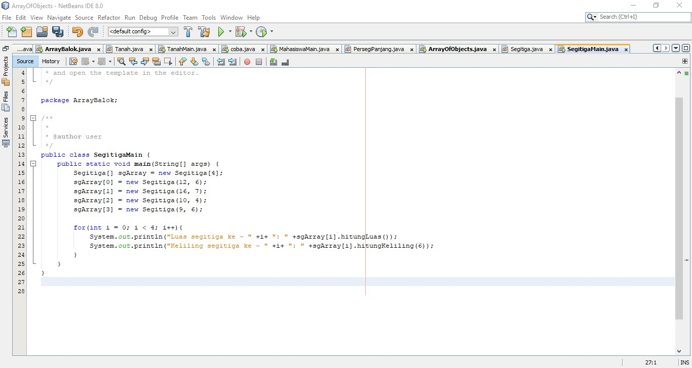
# Source code dan Output Percobaan
## Percobaan 3.2.1
1. Source Code :
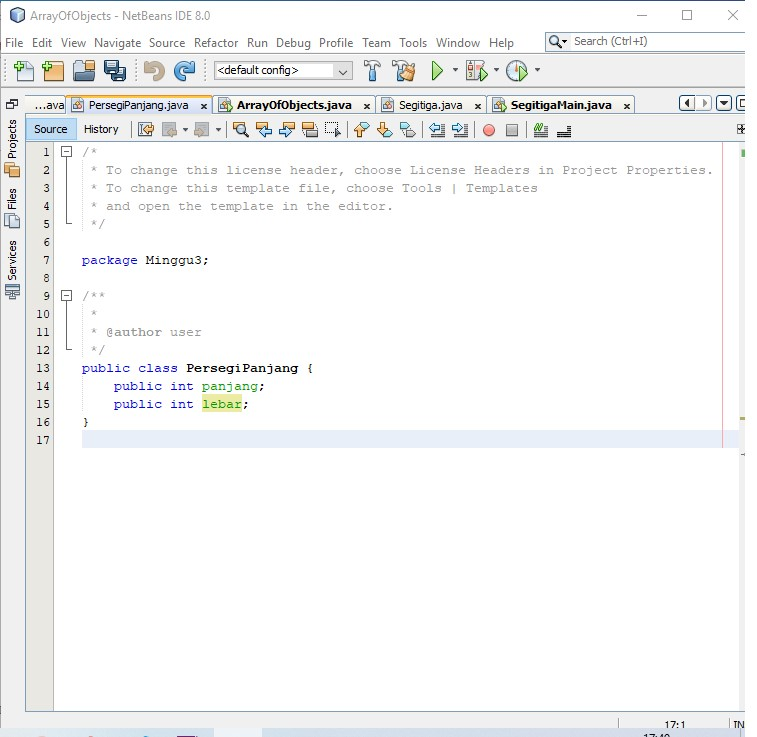
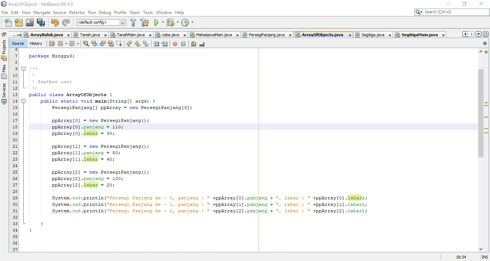
2. Output :
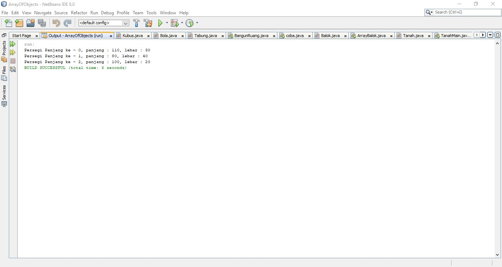
## Percobaan 3.3.1
1. Source Code :
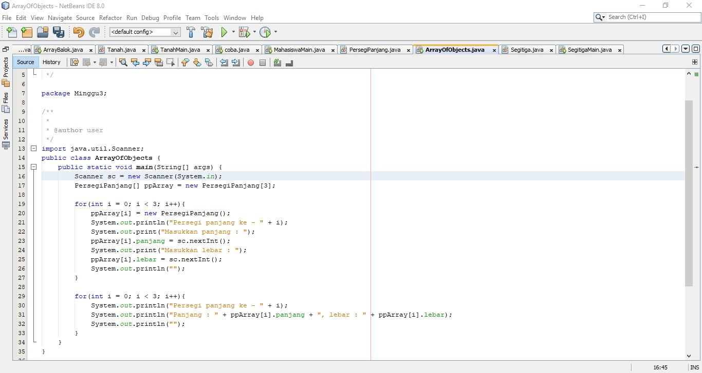
2. Output :
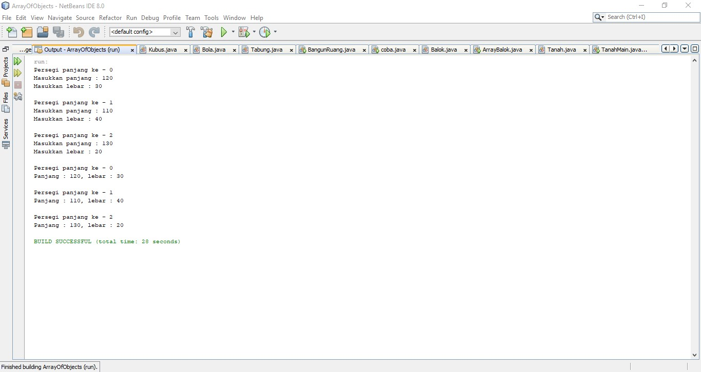
## Percobaan 3.4.1
1. Source Code :

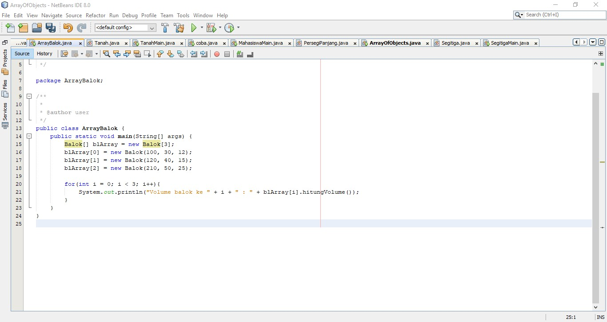
2. Output :
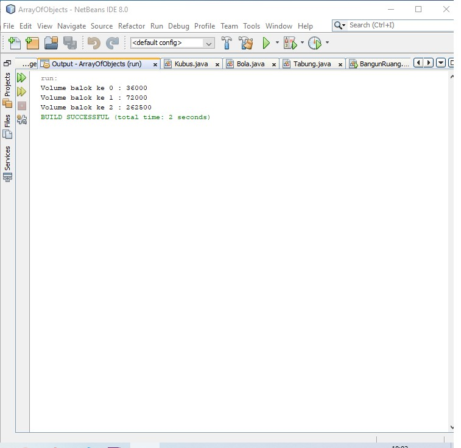