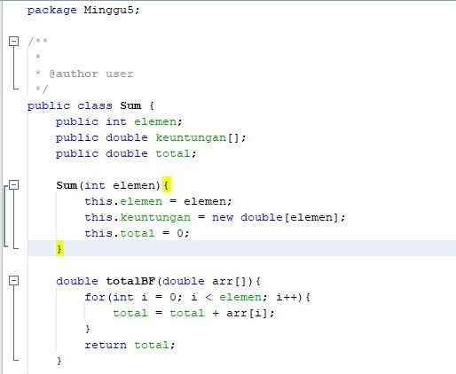

# Latihan Praktikum 5
## Pertanyaan 4.2.3
1. Dalam base line Algoritma Divide Conquer pada class factorial menggunakan pemilihan if (n==1) return 1; yang artinya jika nilai yang akan dimasukkan nantinya adalah 1 maka hasil yang akan ditampilkan olehprogram main nantinya adalah 1 dan berfungsi sebagai batas dari divide conquer dimana perulangan kali akan berakhir saat n sudah sama dengan 1.
2. Pada percobaan 1 implementasi Algoritma Divide and Conquer sudah lengkap terdiri dari 3 tahapan dimana :

a. Divide : membagi masalah menjadi beberapa upa-masalah yang memiliki kemiripan dengan masalahsemula namun berukuran lebih kecil (idealnya berukuran hampir sama).Dalam kodingan percobaan 1 faktorial, divide ditujukan oleh adanya pemecahan masalah menjadi 2 upa masalah yang diisyaratkan dengan kondisi pemilihan if-else dimana if berperan sebagai base case dan else sebagai rekursif call.

Coding :

b. Conquer: memecahkan (menyelesaikan) masing-masing upamasalah (secara rekursif).Dalam kodingan percobaan 1 faktorial, conquer ditujukan oleh adanya penyelesaian masalah secara reqursif dimana upa masalah diselesaikan masing-masing yang telah diisyaratkan pada codingan dalam else yang memberikan rumus int fakto = n * faktorialDC(n-1); yang berarti nanti setiap upa masalah akan dikalikan sendiri-sendiri.

Coding :

c. Combine: mengabungkan solusi masing-masing upa-masalah sehingga membentuk solusi masalah semula.Dalam kodingan percobaan 1 faktorial, combine ditujukan oleh adanya penarikan hasil keseluruhan berupa return atau pengembalian nilai dari proses rekursif pada tahap conquer yang diisyaratkan pada return fakto; di else dalam method faktorialDC();

Coding :

3. Bisa, selama termasuk looping maka jenis looping apapun bisa digunakan pada method faktorialBF() dan saya sudah mencoba membuktikannya dengan looping jenis while dan program tetap berjalan dengan baik.

Coding :

Output : 

4. 
5. Terdapat perbedaan waktu beberapa milidetik

## Pertanyaan 4.3.3
1. Perbedaannya adalah pada method pangkatBF() menggunakan algoritma brute force, sedangkan pada pangkatDC() menggunakan algoritma divide conquer.
2. Pada kondisi if, program akan menghitung bilangan yang dipangkatkan jika bilangan tersebut merupakan bilangan ganjil. Sedangkan, pada kondisi else program akan menghitung bilangan yang dipangkatkan jika bilangan tersebut merupakan bilangan genap.
3. Sudah

4. Hasil Modifikasi :

5. Hasil Modifikasi : 

Source Code :

Output :

## Pertanyaan 4.4.3
1. Method TotalBF() digunakan untuk memecahkan suatu persoalan, biasanya didasarkan pada problem statement dan definisi konsep yang dilibatkan. Algoritma Brute Force memecahkan masalah dengan sangat sederhana, langsung dan dengan cara yang jelas. Sedangkan, method TotalDC() digunakan untuk memecah masalah menjadi submasalah - submasalah independen yang lebih kecil sehingga solusi submasalah - submasalah dapat diperoleh secara mydah, solusi submasalah - submasalah digabung menjadi solusi seluruh masalah.
2. Untuk membuat output di belakang koma agar menjadi standar untuk kedua jenis algoritma tersbutsaya menggunakan system pencetakan output dengan system.out.printf untuk mengoutputkan format sesuai yang dimasukkan. Pada cetakan akhir saya menambahkan sintaks %.2f maksudnya agar banyaknya angka dibelakang koma bisa dibulatkan dan menjadi 2 angka saja dibelakang koma sehingga hasil dari kedua algoritma tersebut punya standar yang sama.

3. Untuk mereturnkan semua hasil dari penjumlahan keuntungan dari lsum (penjumlahan left/kiri) lalu dengan rsum (penjumlahan right/kanan) dan dengan arr[mid] (penjumlahan mid/tengah), sehingga daripenjumlahan ketiganya bisa diketemukan berapa banyak keuntungan yang didapat dari perusahaan tersebut dalam rentang waktu n bulan.

4. Karena perhitungan keuntungan pada method totalDC() tersebut membagi bagiannya menjadi left(l) dan right(r) dan dibutuhkan variable mid untuk menghitungan semua bagian tengahnya. Misalkan array = 1,2,3,4,5 maka l adalah indeks 0/awal dan r adalah indeks 4/terakhir dan l masih belum == dengan r maka dibagi menjadi 2 bagian dan mid = indeks 2 karena (l+r)/2.Lalu pada bagian left berarti dimulai dari indeks l(l=0) dan diakhiri indeks mid-1, sedangkan pada bagian right dimulai dari indeks mid dan diakhiri r (r=4). Dan terus menerus dibagi 2 hingga indeks l==r dan mereturnkan nilai tersebut.

5. Source Code :

Output :

# Source Code & Hasil Output Program
## Praktikum 4.2.1
1. Source Code :

2. Hasil Output :

## Praktikum 4.3.1
1. Source Code :

2. Hasil Output :

## Praktikum 4.4.1
1. Source Code :

2. Hasil Output :
