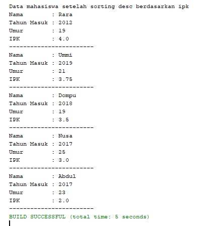

# Latihan Praktikum 6
## Pertanyaan 5.2.3
1. Terdapat pada method bubbleSort()
2. Tidak ada
3. Proses swap adalah proses pertukaran tempat data setelah data tersebut diurutkan.
Mahasiswa tmp = listMhs[j];
listMhs[j] = listMhs[j-1];
list mhs[j-1] = tmp;
4. Untuk melakukan proses pengurutan serta swap antar data.
5. a. Perulangan i dilakukan untuk proses iterasi atau tahapan perulangan selanjutnya hingga mencapai batas yang sudah ditentukan. Perulangan j digunakan untuk proses pengurutan serta swapping antar data setelah diurutkan. 
b. Untuk melakukan pergantian dari proses iterasi satu ke proses iterasi berikutnya, sehingga dilakukan pengurangan i < listMhs.length -1
c. Untuk melakukan pertukaran serta swapping antar satu data ke data berikutnya, sehingga dilakukan pengurangan j < listMhs.length - i
d. 49 kali, 49 tahapan
## Pertanyaan 5.3.3
1. Digunakan untuk proses pengurutan antar data dan proses swapping setelah data tersebut diurutkan.
## Pertanyaan 5.3.4
1. 

# Source Code & Hasil Output
##  Percobaan 5.2.1

1. Source Code :

2. Hasil Output : 

## Percobaan 5.3.1

1. Source Code

2. Hasil Output :

## Percobaan 5.4.1

1. Source Code

2. Hasil Output :

