# Latihan Praktikum 7
## Pertanyaan 6.2.3
1. Method tampil data digunakan untuk menampilkan output dari data mahasiswa yang dicari jika ditemukan. Method tampil posisi digunakan untuk menampilkan posisi dari data mahasiswa yang dicari jika ditemukan.
2. Break digunakan untuk menghentikan proses perulangan jika kita sudah menemukan data yang ingin kita cari.
3. Masih, karena di class main diminta untuk memasukkan urutan dari kecil ke besar supaya pada saat data ditampilkan hasilnya akan berurutan sehingga tidak berpengaruh apapun walaupun data dimasukkan secara tidak berurutan.
## Pertanyaan 6.3.3
1. 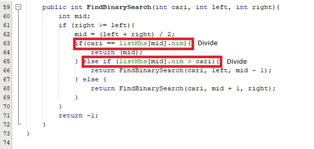
2. 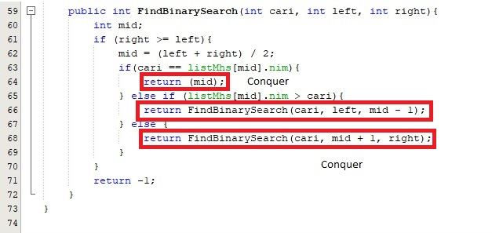
3. Masih, karena di class main diminta untuk memasukkan urutan dari kecil ke besar supaya pada saat data ditampilkan hasilnya akan berurutan sehingga tidak berpengaruh apapun walaupun data dimasukkan secara tidak berurutan.
4. Hasilnya tidak sesuai. Hasil Modifikasi : 
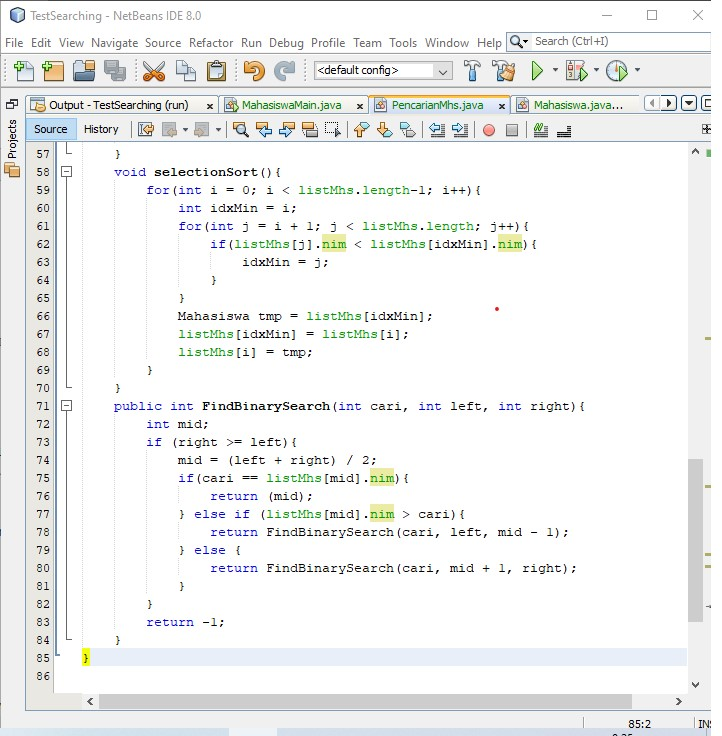
5. 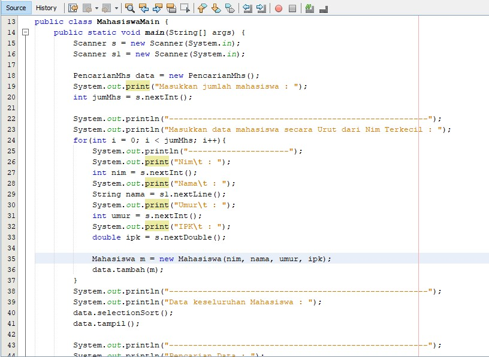

# Source Code & Hasil Output
## Percobaan 6.2.1
1. Source Code 

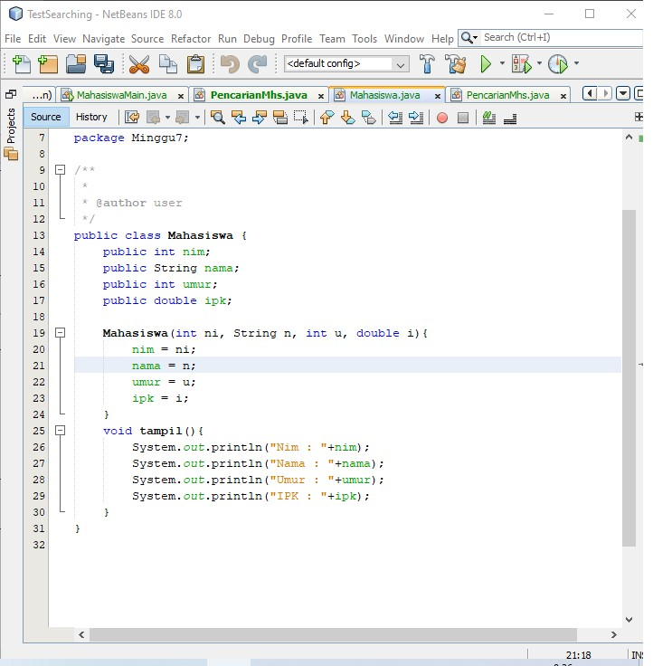
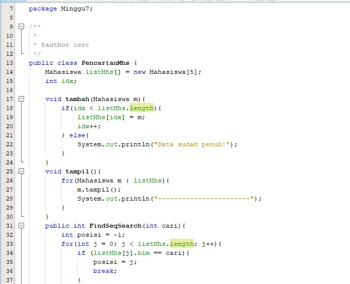
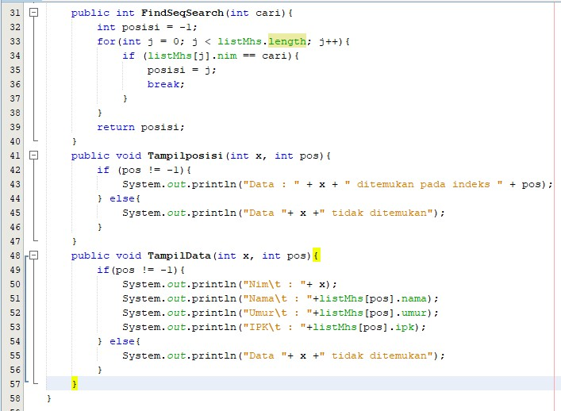
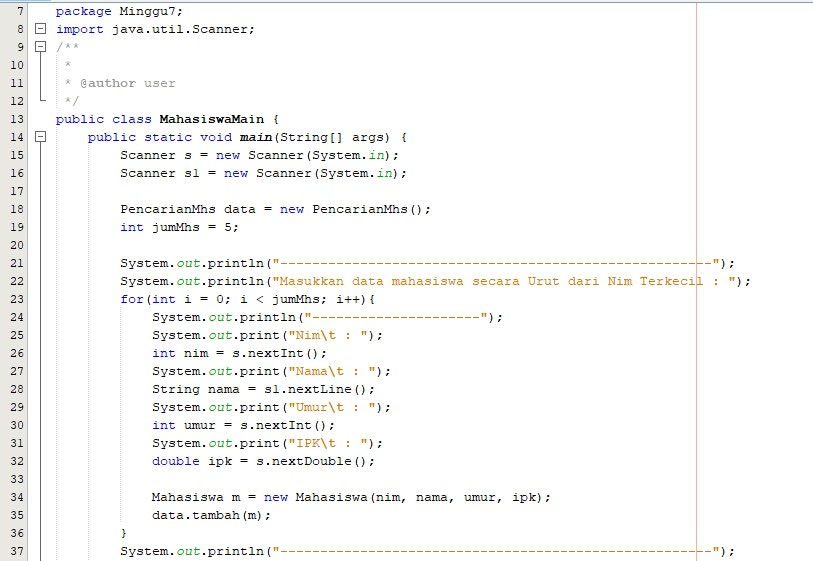
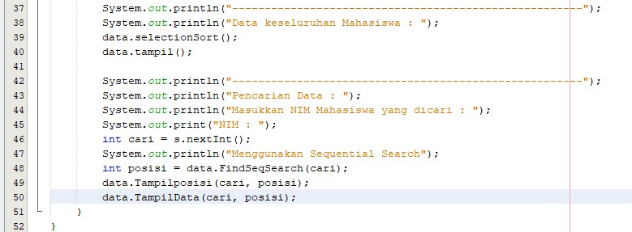

2. Hasil Percobaan 

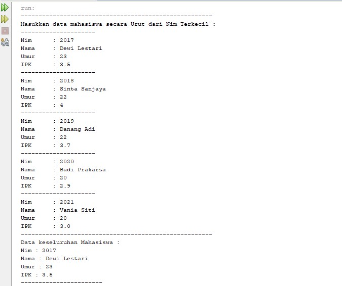
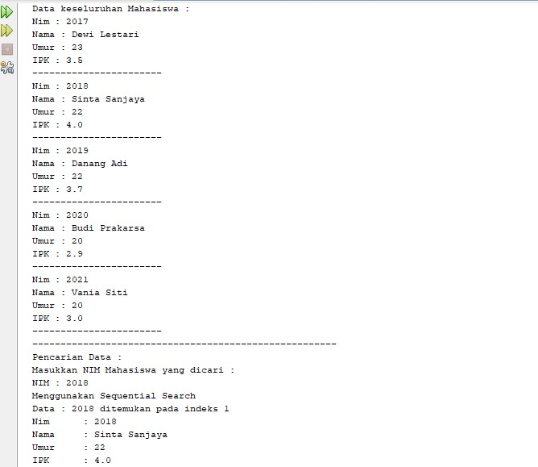

## Percobaan 6.3.1
1. Source Code

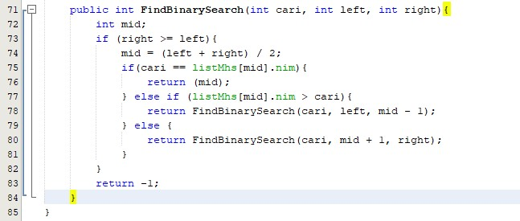
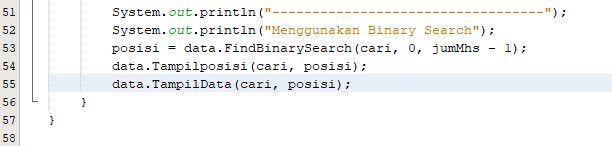

2. Hasil Output

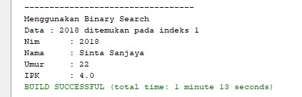

## Percobaan 6.4.1
1. Source Code

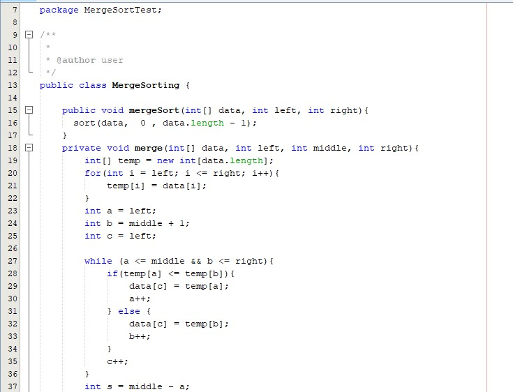
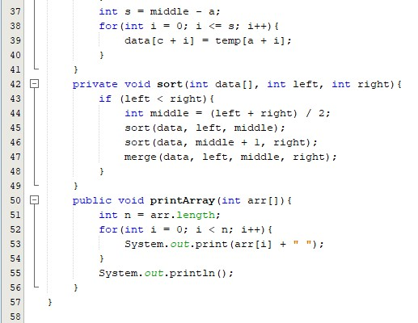
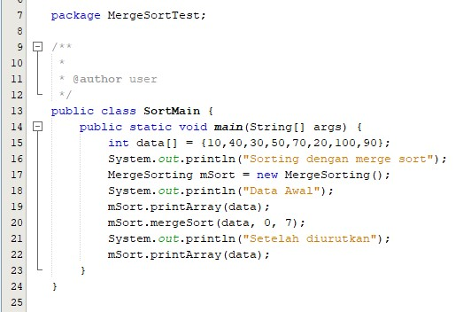

2. Hasil Output
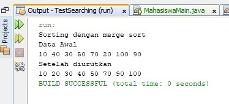