# Latihan Praktikum 9
## 7.2.3 Pertanyaan
1. Fungsi angka 5 pada potongan kode program berikut digunakan untuk membuat size atau ukuran stack, yakni 5.
2. 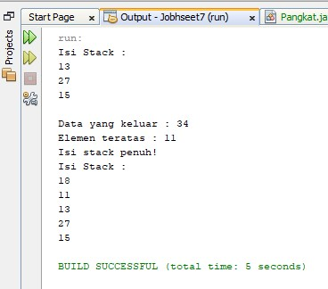
3. Karena isi stack sudah penuh, maksimal isi stack hanya 5. Apabila ditambahkan angka 18 dan 40, maka angka 40 tidak akan masuk karena maksimal isi stack hanya 5 saja.

## 7.3.3 Pertanyaan
1. Data yang tersimpan dalam bk adalah data tentang buku yang akan dimasukkan ke dalam stack, seperti judul, nama pengarang, tahun terbit, jumlah halaman dan harganya.
2. 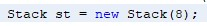
3. Penggunaan do-while pada stack digunakan sebagai perulangan untuk memasukkan data buku yang akan disimpan ke dalam stack.
4. 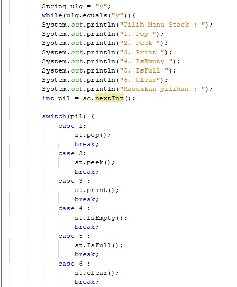 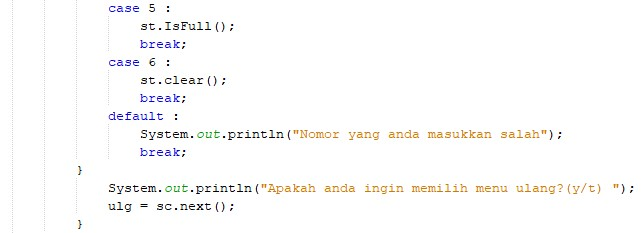

## 7.4.3 Pertanyaan
1. Method derajat merupakan method yang mempunyai nilai kembalian integer untuk menentukan derajat operator, jika kita memilih case '^', maka nilai kembaliannya adalah 3. Jika kita memilih case '%', maka nilai kembaliannya adalah 2. Jika kita memilih case '/', maka nilai kembaliannya adalah 2. Jika kita memilih case '*', maka nilai kembaliannya adalah 2. Jika kita memilih case '-', maka nilai kembaliannya adalah 1. Jika kita memilih case '+', maka nilai kembaliannya adalah 1. Untuk defaultnya diset mengembalikan nilai 0. 
2. Kode program tersebut digunakan untuk mengambil karakter pada sebuah String sesuai index yang diinginkan. Catatan : Index pada String di awali dari 0 (nol).
3. 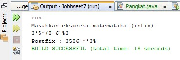
4. Karena jika ditemukan simbol kurung buka “(“
Operasi push pada stack akan digunakan untuk menyimpan simbol tersebut ke dalam stack. Jika ditemukan simbol kurung buka “)” Operasi pop digunakan untuk mengeluarkan operator-operator yang berada di dalam stack. Jika terdapat simbol operator, Jika dalam suatu untai notasi infix ditemukan simbol operator maka operasi yang dilakukan pada stack terbagi atas :
Jika TOP(S) dari stack tersebut kosong atau berisi simbol “(“ maka operasi push akan digunakan untuk memasukan operator tersebut pada posisi di TOP(S)
Jika operator yang berada dipuncak stack merupakan elemen yang memiliki tingkat yang sama atau lebih tinggi maka operasi pop digunakan untuk mengeluarkan operator tersebut diikuti operasi push untuk menyimpan operator hasil scanning untai.
Jika operator yang berada di puncak stack memiliki tingkat yang lebih rendah dari operator yang discan, maka operator baru akan langsung dimasukan ke dalam stack dengan operasi push.

# Source Code & Hasil Output Program
## 7.2.1 Percobaan
1. Source Code :

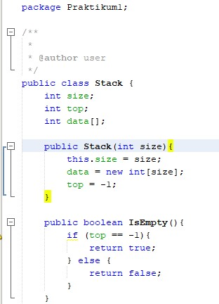

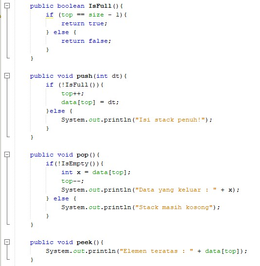

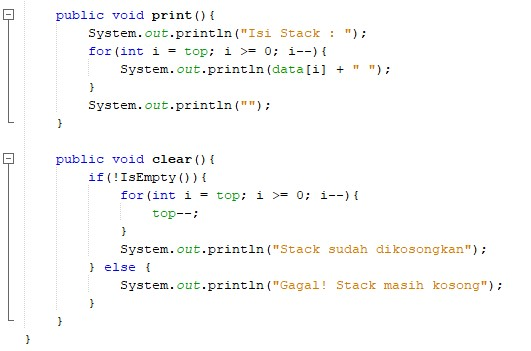

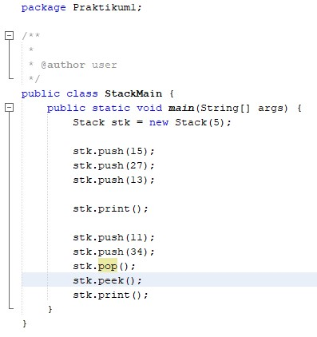

2. Hasil Output :

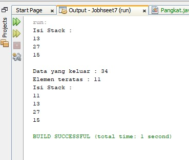

## 7.3.1 Percobaan
1. Source Code :

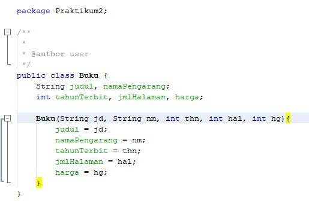

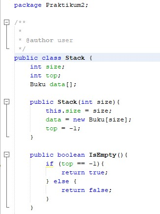

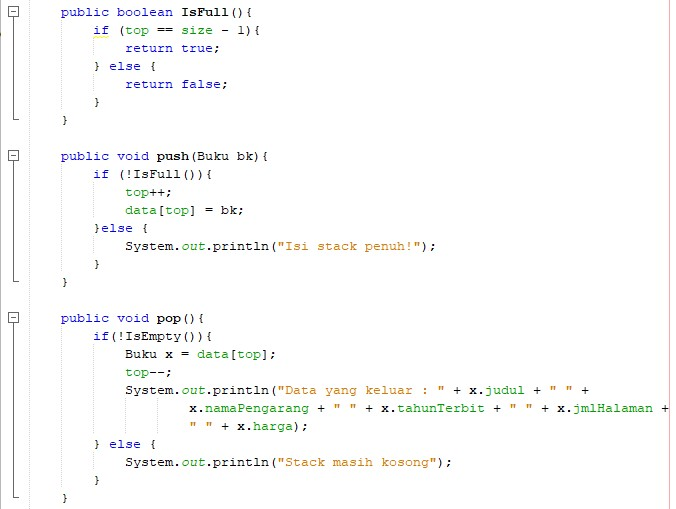

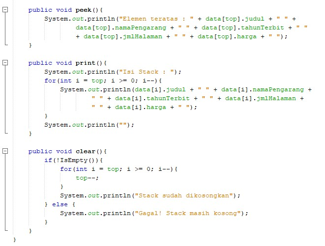

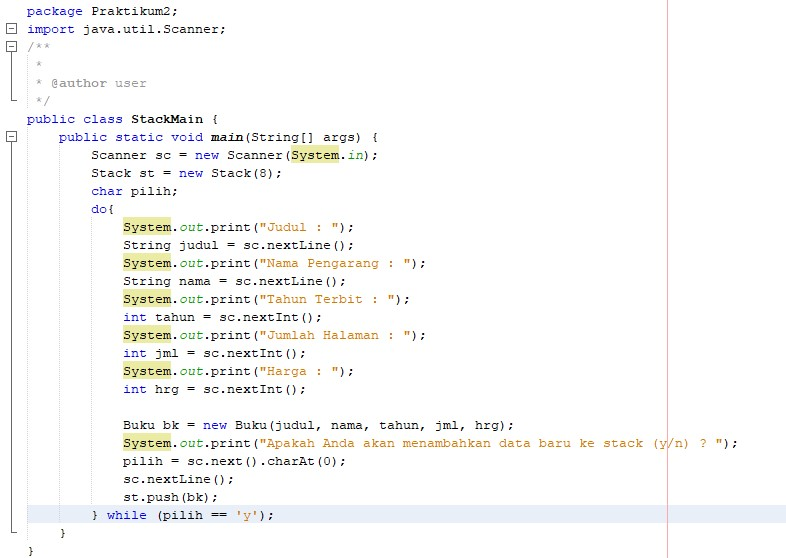

2. Source Code :

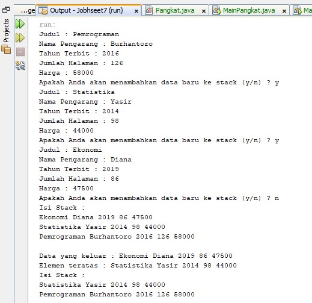

## 7.4.1 Percobaan
1. Source Code :

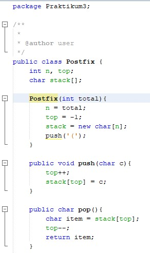

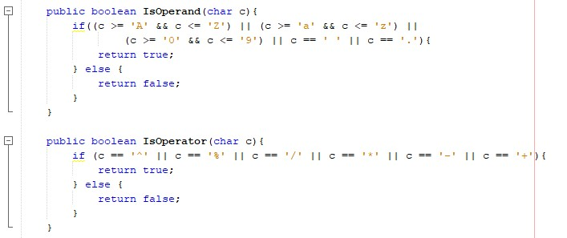

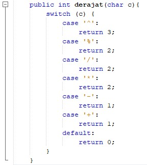

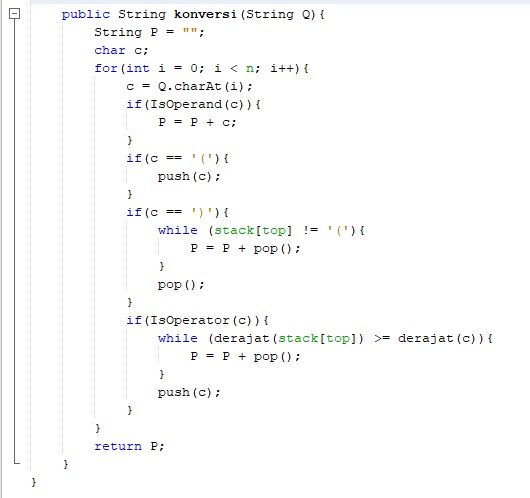

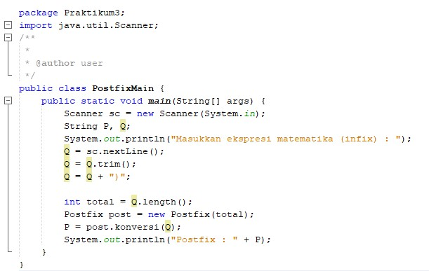

2. Hasil Output :

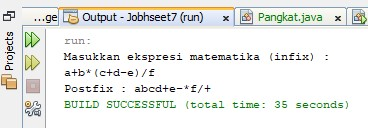