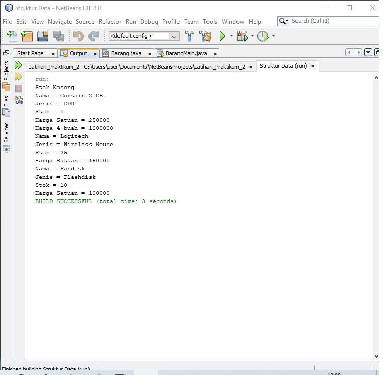

# Latihan Praktikum 2
## Pertanyaan 2.2.3
1. Atribut dan Method
2. Barang
3. Empat, namaBarang, jenisBarang, hargaSatuan dan stok. Pada baris ke 13 dan 14.
4. Empat, tampilBarang, tambahStok, kurangiStok dan hitungHargaTotal. Pada baris ke 16 hingga 33.
5. 
6. Karena pada method tersebut digunakan untuk menjumlahkan  stok dengan parameter n yang di isikan pada main.
Karena harga total yang dihasilkan berupa bilangan bulat.
Supaya kita tidak perlu melakukan return.
## Pertanyaan 2.3.3
1. Pada baris ke 15, nama objek yang dihasilkan adalah b1.
2. Dengan menuliskan nama objek yang telah kita buat sebelumnya dan mengisi atribut serta memanggil method yang telah kita buat sebelumnya.
## Pertanyaan 2.4.3
1. Pada baris ke 16 hingga 23.
2. Memanggil serta mengisi data konrtsuktor yang telah dibuat sebelumnya.
3. 

# Source Code & Output Program
## Percobaan 2.2.1
1. 
2. 
3. 
## Percobaan 2.3.1
1. 
2. 